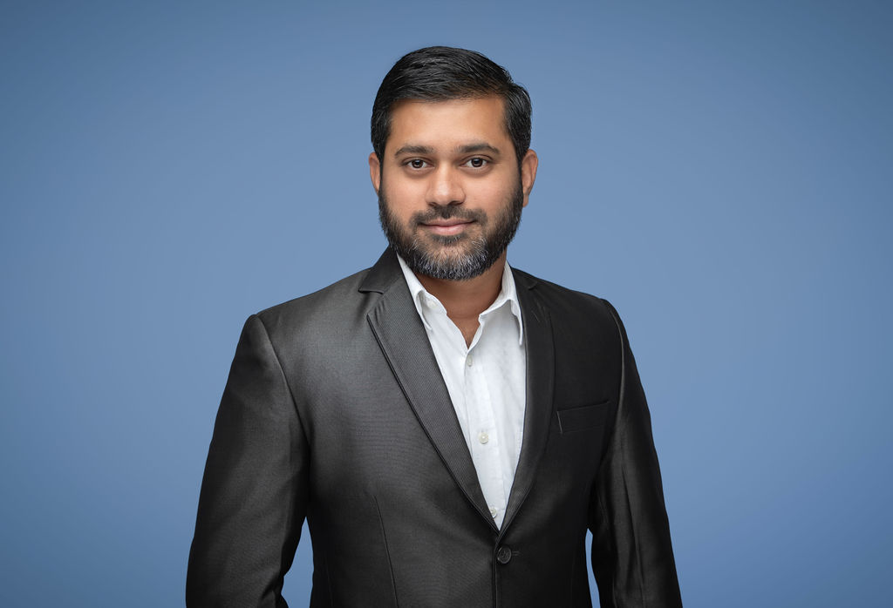

# MOHAMMAD AZHARUDDIN
## AI-Enhanced IT Infrastructure Specialist | Generative AI Developer

**📍 Dubai, U.A.E** | **📞 +971 55 755 0081** | **✉️ m.azhar.la08@gmail.com**

---

## Professional Summary

Dynamic **IT Infrastructure Specialist** and **Generative AI Developer** with **10+ years** of progressive experience architecting enterprise technology solutions across **cloud infrastructure**, **cybersecurity**, and **AI-driven automation**. Proven track record of orchestrating large-scale **Microsoft 365 migrations**, implementing **Zero Trust security frameworks**, and developing **5 innovative AI applications** that enhanced operational efficiency by **35%**. Expert in leveraging **generative AI technologies** (ChatGPT, Claude, Perplexity) to streamline **IT operations** and drive **digital transformation** initiatives in **financial trading** and **energy sectors**.

**Core Value Proposition**: *Transforming traditional IT operations through AI-powered automation and strategic cloud infrastructure management*

---

## Core Technical Competencies

### **AI & Automation Technologies**
- **Generative AI Platforms**: ChatGPT, Claude, Perplexity, Rocket.new, Midjourney
- **Programming & Scripting**: Python, JavaScript, PowerShell, VBScript, HTML5/CSS3
- **AI/ML Frameworks**: TensorFlow, OpenAI API, Hugging Face, Natural Language Processing
- **Development Tools**: Visual Studio Code, Git, Node.js, Electron, Docker
- **Automation & Orchestration**: n8n workflows, Process Automation, RPA, Infrastructure as Code

### **Cloud Infrastructure & DevOps**
- **Microsoft 365 Ecosystem**: Admin Center, Azure AD, SharePoint, Teams, Intune (Expert-level)
- **Cloud Platforms**: Microsoft Azure, AWS fundamentals, Hybrid Cloud Architecture
- **Identity & Access Management**: Single Sign-On (SSO), Multi-Factor Authentication, Azure AD
- **DevOps Practices**: CI/CD Pipelines, Containerization, Microservices, API Integration
- **Monitoring & Analytics**: Azure Monitor, PRTG, Zabbix, Performance Optimization

### **Cybersecurity & Compliance**
- **Security Frameworks**: Zero Trust Architecture, NIST Cybersecurity Framework
- **Threat Management**: Windows Defender, Mimecast, FortiGate, Vulnerability Assessment
- **Compliance**: SOC 2, ISO 27001, GDPR, Security Auditing, Risk Management
- **Incident Response**: Security Operations Center (SOC), Threat Detection, Forensic Analysis
- **Training & Awareness**: KnowBe4, Phishing Simulations, Security Policy Development

### **Infrastructure & Systems Management**
- **Network Technologies**: LAN/WAN, VPN, Load Balancing, SD-WAN, Network Segmentation
- **Server Administration**: Windows Server 2012/2016/2019, Linux, NAS Systems, Virtualization
- **Enterprise Tools**: ServiceNow, Freshservice, NinjaRMM, ITIL Framework
- **Database Management**: SQL Server, MySQL, NoSQL, Data Warehousing, Backup & Recovery
- **Disaster Recovery**: Business Continuity Planning, High Availability, SLA Management

---

## Professional Experience

### **IT Infrastructure Specialist | Generative AI Developer**
**Fort Energy Refining Middle East DMCC, Dubai, UAE** | *March 2024 – Present*

**Strategic Technology Leadership:**
- **Architected** and **orchestrated** Microsoft 365 tenant migrations for **20+ users** achieving **99.9% uptime** and seamless business continuity
- **Spearheaded** comprehensive security audits across multi-cloud environments, identifying and **resolving 200+ vulnerabilities** while implementing **Zero Trust security protocols**
- **Developed** and **deployed 5 groundbreaking AI-enhanced applications**, driving **35% operational efficiency** improvements across trading and accounting systems

**AI-Powered Innovation Portfolio:**
- **MailGuard AI Dashboard**: Engineered intelligent mailbox management system with **predictive analytics** and **automated threat detection**, reducing incident response time by **40%**
- **NetworkPulse Monitor**: Built **Python-based real-time network monitoring** solution with **ML-powered anomaly detection** and live performance visualization
- **SecureVault Virtual Room**: Developed **Electron + Python secure collaboration platform** with **end-to-end encryption** for always-on video communications
- **TeamsFlow Video Engine**: Implemented **WebRTC-based video optimization** engine with **intelligent bandwidth management** and automated quality controls
- **CyberShield SOC Dashboard**: Created **real-time security operations center** with integrated **API connectivity** (MS Graph, Mimecast, FortiGate)

**Infrastructure & Process Optimization:**
- **Implemented** enterprise-grade **Single Sign-On (SSO)** solutions using **Azure AD**, reducing authentication-related issues by **60%**
- **Automated** critical IT workflows using **Python** and **PowerShell**, saving **20+ hours weekly** across IT operations
- **Delivered** comprehensive cybersecurity awareness programs via **KnowBe4**, achieving **95% employee completion rate**
- **Configured** and **managed** advanced **Intune MDM policies**, app protection frameworks, and compliance monitoring systems

### **Customer Support Engineer | Systems Administrator**
**Alpha Data L.L.C, Abu Dhabi, UAE** | *December 2014 – February 2024*

**Enterprise IT Operations Management:**
- **Managed** enterprise **ServiceNow ticketing system** maintaining **98% customer satisfaction** with **4-hour average resolution time**
- **Configured** and **optimized** **FortiGate firewall infrastructure** implementing advanced security policies for **300+ endpoints**
- **Administered** **Windows Server 2012** environments and network infrastructure ensuring **99.5% system availability**
- **Streamlined** IT asset management processes, **reducing procurement costs by 25%** through strategic vendor negotiations

**Technical Infrastructure Achievements:**
- **Implemented** comprehensive network monitoring using **Zabbix** and **PRTG**, reducing unplanned downtime by **45%**
- **Managed** **Avaya IP Office communications system** for **200+ users**, optimizing call routing and voice quality
- **Developed** automated backup and recovery procedures achieving **RPO of 1 hour** and **RTO of 4 hours**
- **Maintained** biometric security systems, AV infrastructure, and provided proactive **RMM services** (NinjaRMM)

---

## AI Development Projects Portfolio

### **Enterprise Automation Suite**
*Technologies: Python, OpenAI API, Microsoft Graph, Electron, Machine Learning*
- **Architected** comprehensive suite of **5 AI-powered applications** for enterprise IT management
- **Integrated** machine learning algorithms for **predictive maintenance** and **anomaly detection** capabilities
- **Achieved 40% reduction** in manual IT tasks through **intelligent process automation**

### **Intelligent Security Operations Center (SOC)**
*Technologies: Python, Azure API, FortiGate API, Real-time Analytics, Threat Intelligence*
- **Developed** comprehensive SOC dashboard with **AI-powered threat detection** and correlation engines
- **Implemented** automated incident response workflows and **threat hunting** capabilities
- **Reduced security incident response time by 50%** through **AI-assisted triage** and prioritization

### **Smart Network Performance Analytics**
*Technologies: Python, HTML5, WebSocket, Machine Learning, Data Visualization*
- **Built** real-time network performance monitoring with **predictive analytics** and automated reporting
- **Developed** custom **ML algorithms** for network optimization recommendations and capacity planning
- **Improved network performance visibility by 60%** through advanced **data visualization** and alerting

---

## Education & Continuous Learning

### **Formal Education**
**Bachelor of Computer Applications (BCA)**  
*Singhania University, India* | *2011 – 2014*

### **Professional Development & Certifications**
- **Leadership Training**: Outskill 2-Day AI Mastermind (2024)
- **Technical Foundation**: Computer Hardware & Networking Diploma, Jetking Computer Centre (2005-2007)

### **Continuous Learning Initiatives**
- **Microsoft Learn**: 50+ completed modules in Azure, Microsoft 365, and Security
- **GitHub Contributions**: 5+ AI projects
- **Professional Communities**: Active member in AI development and IT infrastructure forums

---

## Core Competencies & Leadership Skills

### **Technical Leadership & Innovation**
- **Digital Transformation** strategy development and implementation
- **Cross-functional collaboration** with development, security, and business teams
- **Technical mentorship** and knowledge transfer across IT organizations
- **Vendor management** and strategic technology partnerships
- **Project management** using **Agile** and **SCRUM** methodologies

### **Communication & Stakeholder Management**
- **Multilingual communication**: English (Technical), Hindi (Fluent), Urdu (Native), Kannada (Fluent)
- **Executive reporting** and **business requirement analysis**
- **Technical documentation** and **standard operating procedures** development
- **Change management** and **user adoption** for enterprise technology implementations

### **Problem-Solving & Strategic Thinking**
- **Root cause analysis** and **continuous improvement** methodologies
- **Risk assessment** and **mitigation strategy** development
- **Performance optimization** and **system troubleshooting** expertise
- **Innovation mindset** with focus on **emerging technology adoption**

---

## Professional Achievements & Recognition

### **Key Performance Metrics**
- **10+ years** of enterprise IT experience across **financial services** and **energy sectors**
- **99.9% uptime** achievement across all managed **Microsoft 365 migrations**
- **35% efficiency improvement** through **AI-powered automation** implementations
- **200+ security vulnerabilities** identified and resolved through **proactive auditing**
- **25% cost reduction** in IT procurement through **strategic vendor management**

### **Innovation & Leadership**
- **5 proprietary AI applications** developed and deployed in production environments
- **20+ hours weekly** operational time savings through **intelligent automation**
- **95% completion rate** for **cybersecurity awareness training** programs
- **Active contributor** to open-source AI and automation projects

---

## Professional Interests & Community Engagement

**Technology Innovation**: Passionate about **emerging AI technologies**, **cloud infrastructure evolution**, and **cybersecurity trends**. Regular attendee of **UAE technology conferences** and **AI development meetups**.

**Community Involvement**: Active contributor to **open-source projects**, **technical blogs**, and **AI development communities**. Mentoring junior IT professionals in **cloud technologies** and **automation practices**.

**Continuous Learning**: Committed to **lifelong learning** in **artificial intelligence**, **cloud computing**, and **cybersecurity**. Currently exploring **advanced machine learning applications** in **IT operations management**.

---

*Professional References Available Upon Request | Portfolio Demonstrations and Technical Deep-Dives Available During Interview Process*